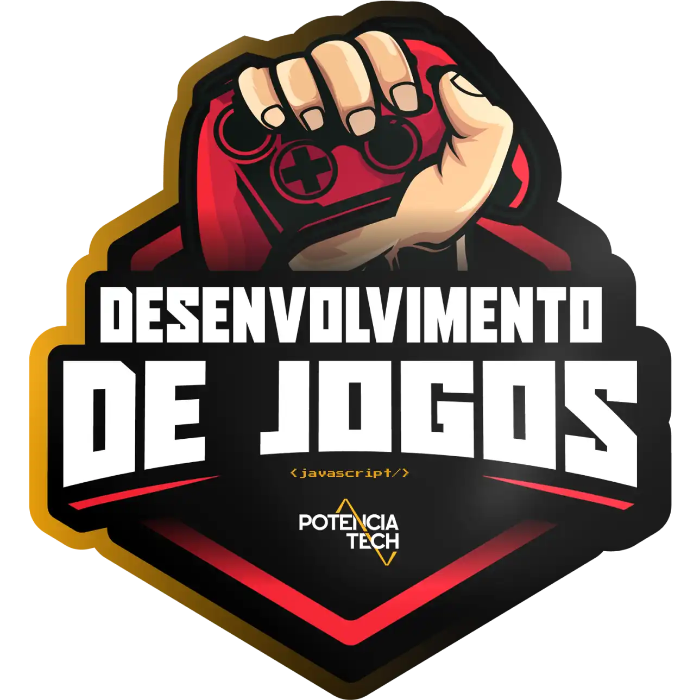

<div align="center">
  

  # Potência Tech iFood - Desenvolvimento de Jogos
  **DESAFIO DE PROJETO:** <br> Criando um Jogo do Detona Ralph com JavaScript

  <br>

  ### Imagens do projeto funcionando
  Projeto funcionando, [jogar↗](https://projeto-detona-ralph.netlify.app/) na [netlify↗](https://www.netlify.com)

  
</div>

<br>

### 📚 DESCRIÇÃO
*Vamos utilizar HTML, CSS e Javascript para criar um jogo baseado no filme Detona Ralph, aonde o objetivo é acertar o Ralph na janela que ele aparecer, ao longo do projeto vamos explorar eventos Javascript e manipular áudios no browser.* ```HTML5``` ```CSS3``` ```JavaScript```

---

### 🎯 AGORA É A SUA VEZ
*Chegou a hora de colocar em prática tudo aquilo que você aprendeu durante esse projeto.*

---

### 👨‍💻 OBJETIVO:
*Sua missão vai ser reproduzir passo passo o projeto visto nessa aula, ao final
suba seu projeto no Github e compartilhe conosco clicando no botão "Entregar Projeto" e cole o link do seu repositório do Github.*

### 🔗 Links Úteis
*Sabemos que toda jornada tem seus desafios, por isso separamos alguns links que podem te ajudar durante esse processo:*

➡ Projeto funcionando hospedado na [netlify](https://www.netlify.com) 👉 [dar play no jogo](https://projeto-detona-ralph.netlify.app/)

Bons estudos 😉

<br>
<br>

---

<p align="center">
  Feito com 💖 por
  <a href="https://github.com/ias4g">Izael Silva</a>
</p>