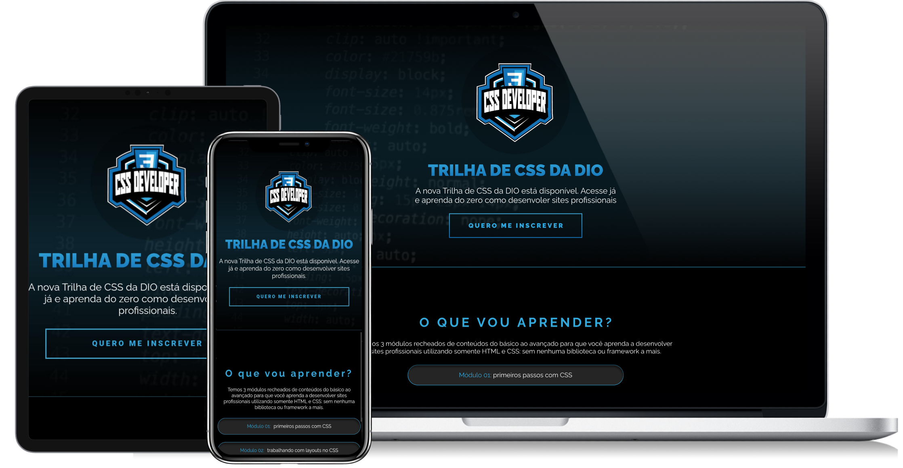

<h1 align="center">Desafio 01:</h1>
<h3 align="center">Criando minha primeira Landing Page com HTML e CSS</h3>

Bem vindo(a) ao primeiro desafio da Trilha de CSS da DIO! Nela, você vai construir sua primeira Landing Page com HTML e CSS, colocando em prática os fundamentos do CSS, as propriedades básicas da linguagem de estilização, além de trabalhar com as unidades de medidas relativas e absolutas que aprendemos ao longo da trilha.

#### 🔖 DESCRIÇÃO:
* Chegou a hora de colocar seus conhecimentos em pratica! Esse desafio tem a proposta da criação da sua primeira Landing Page institucional, utilizando HTML e CSS, onde o usuário poderá visualizar a divulgação de um projeto. Dessa forma, será necessário inserir elementos e informações fundamentais de um site.

> O desafio proposto é uma landpage como está na imagem abaixo: 👇


Dentro da pasta ```~/src/images```, você vai encontrar todas as imagens e o arquivo HTML ```index.html```, contendo a estrutura básica da sua página, está na ```pasta raiz``` faltando apenas
realizar a estilização da sua página. É necessário que você faça toda a parte responsável por interligar sua página HTML com suas folhas
de estilo para que o resultado da estilização funcione.

Também tem um protótipo no figma, que você pode verificar as medidas e estilização para sair o mais parecido possivel, você pode acessar neste link 👉 [Protótipo no Figma](https://www.figma.com/file/K1WeTc2SwzKRYMjUv6sMpX/DIO---Desafio-01?type=design&node-id=22469%3A101&mode=design&t=2yYndTkyVeu8zv9R-1)

*Observações: para aplicar os textos em gradiente, utilize a propriedade CSS background-clip, porém, para funcionar em alguns navegadores, é necessário utilizar a propriedade -webkit-background-clip: text;*

[Clique aqui](https://trilha-css-dio-by-izael-silva.netlify.app/) para acessar o resultado final da Landing Page criada a partir do desafio!